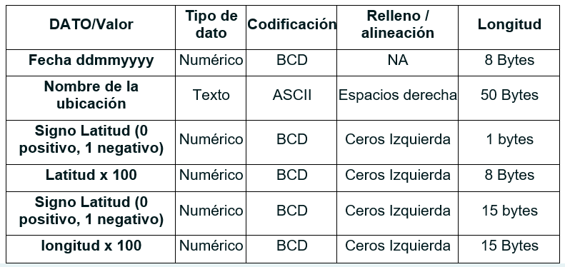

### Quiz 3 - Final

Implementar un programa con un menú de usuario para las siguientes funcionalidades:
 
• Ingresar datos: Recibe los siguientes datos ingresados por el usuario, los almacena en una estructura tipo cola
 
·        Fecha formato ddmmyyyy

·        Nombre de la ubicación

·        Signo Latitud (0 positivo, 1 negativo)

·        Latitud (número float)

·        Signo longitud (0 positivo, 1 negativo)

·        Longitud (número float)

• Generar archivo: Genera un archivo de longitudes fijas para un sistema de información geográfica, el archivo tiene las siguientes características, para esto crear una opción de tal forma que todos los datos almacenados en la cola vayan al archivo.

  

